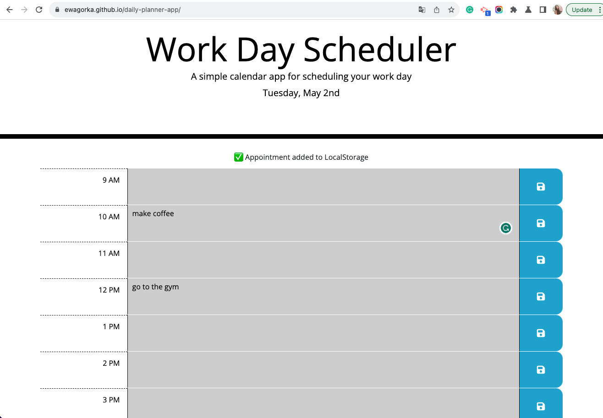

# daily-planner-app
A simple daily planner app - challenge 7 of the Frontend Development Bootcamp

## Project Description
For this week's project, we were asked to write a simple day planner web app. 

The criteria for the app were thati it should:
* Display the current day at the top of the calendar when a user opens the planner.
* Present timeblocks for standard business hours when the user scrolls down.
* Color-code each timeblock based on past, present, and future when the timeblock is viewed.
* Allow a user to enter an event when they click a timeblock.
* Save the event in local storage when the save button is clicked in that timeblock.
* Persist events between refreshes of a page.

## My Approach

As usual, I started by reading the user story, and acceptance criteria and studying the given starter code.

Then I divided my work into 4 main chunks:
1. Update the heading with today's day
2. Recreate a single time block look by using HTML and CSS
3. Create the time block table in Javascript:
    * create rows for all hours
    * create a function that will check the time, and color-code each block
4. Create a function that will save added tasks in localstorage & load them when the user enters the page.

The first task I found very easy to complete, I used a moment library and based on the activities we're done in the past week and the available documentation, I was able to complete this part pretty quickly. 

The second task, surprisingly, took me way more time than I assumed it will. I started by trying to create a single timeblock row and make it look the same as in the reference gif provided. I spent a lot of time looking over the provided classes and adding the !important to some styles to achieve the results I was satisfied with. Additionally, I encountered some issues with adding the font awesome save icon and had to put a different source link than the one provided in the starter code.

After I managed to recreate a look of the timeblock, I decided that I'd rather create my table rows by using JavaScript than copy+paste 8 same structure HTML rows in the HTML file. I used a for loop to create the tr and td elements needed and added classes to them which I believe was a lot neater and followed the DRY approach. After I had the whole table generated I moved on to write a function that will iterate through all of my table rows and add an appropriate colour code class to it based on what time it is.

Next, I added an event listener to the save button objects, that adds whatever the user wrote in the textarea to a tasks array, which then is saved in local storage. Lastly, I created loadTasks function that takes the array from the local storage and fills the appropriate text areas with the previously saved tasks.

Overall I found this task quite challenging, and in many ways, it pushed me to think outside the box - especially when it came to manipulating the time data with the moment. But I can definitely say I learned a lot from my struggles and found it very rewarding in the end.

## Credits
I have used the following page: https://stackoverflow.com/questions/3065342/how-do-i-iterate-through-table-rows-and-cells-in-javascript

To figure out ho to use the .each function to iterate through table contents.
## Technologies
This project was made using HTML, CSS ,and Javascript.

## Deployed Website
The deployed website: https://ewagorka.github.io/daily-planner-app/

## Deployed Website Screenshot and GIF

## License
Please refer to the LICENSE in the repo.